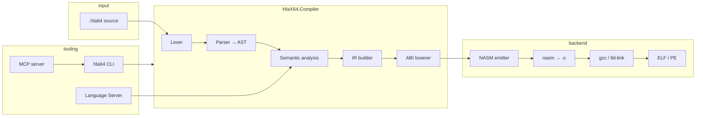

# HlaX64 Architecture

High-level view of the compiler toolchain and agent integration points.

## Pipeline

## Projects

| Project | Role |
|---------|------|
| `HlaX64.Compiler` | Front end, IR, ABI lowering, test runner |
| `HlaX64.Backend.Nasm` | NASM code generation |
| `HlaX64.Runtime` | Platform entry (`_start`, `ExitProcess`), stdlib NASM |
| `HlaX64.Cli` | `build`, `run`, `test`, `explain`, `format`, `doctor`, … |
| `HlaX64.McpServer` | JSON-RPC tools for AI agents |
| `HlaX64.LanguageServer` | Diagnostics-only LSP (stdio) |

## Targets

Two ABIs are supported end-to-end:

- **linux-x64-sysv** — System V AMD64, inline syscalls in freestanding mode
- **windows-x64-msabi** — Microsoft x64 calling convention, `ExitProcess` / `WriteConsoleA`

The ABI lowerer maps HlaX64 procedures to register/stack assignments before NASM emission.

## Testing layers

1. **Unit tests** (`dotnet test`) — parser, semantic, IR, emitter
2. **Conformance** (`tests/conformance/`) — valid/invalid source fixtures
3. **Native samples** (`tests/samples/`) — build, link, run with manifests
4. **Curriculum manifests** (`tests/examples-curriculum/`) — same runner, paths into `examples/`
5. **ExamplesCompileTests** — all 20 curriculum `.hla64` files compile in CI

## Agent surfaces

| Surface | Use case |
|---------|----------|
| MCP `explain` | Inspect IR + NASM before executing |
| MCP `doctor` | Verify toolchain in agent environment |
| MCP `test` | Run manifest directories |
| CLI `--json` | Structured output with `schemaVersion` |
| LSP | Editor diagnostics while typing |

See [mcp-tools.md](mcp-tools.md) and [tutorials/04-mcp-agent.md](tutorials/04-mcp-agent.md).

## Related docs

- [language-spec.md](language-spec.md)
- [roadmap.md](roadmap.md)
- [classic-hla-comparison.md](classic-hla-comparison.md)
