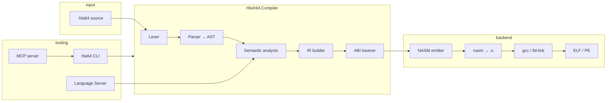

# HlaX64 Architecture

High-level view of the compiler toolchain and agent integration points.

## Pipeline



## Projects

| Project | Role |
|---------|------|
| `HlaX64.Compiler` | Front end, IR, ABI lowering, test runner |
| `HlaX64.Backend.Nasm` | NASM code generation |
| `HlaX64.Runtime` | Platform entry (`_start`, `ExitProcess`), stdlib NASM |
| `HlaX64.Cli` | `build`, `run`, `test`, `explain`, `format`, `doctor`, … |
| `HlaX64.McpServer` | JSON-RPC tools for AI agents |
| `HlaX64.LanguageServer` | Diagnostics-only LSP (stdio) |

## Targets

Two ABIs are supported end-to-end:

- **linux-x64-sysv** — System V AMD64, inline syscalls in freestanding mode
- **windows-x64-msabi** — Microsoft x64 calling convention, `ExitProcess` / `WriteConsoleA`

The ABI lowerer maps HlaX64 procedures to register/stack assignments before NASM emission.

## Multi-architecture strategy

**Status:** informative — not on the active implementation roadmap.

AArch64 is a first-class architecture for mobile, Apple silicon, embedded, and much of cloud compute, but it is **not** a near-term replacement for x86-64 everywhere. Windows desktop, gaming, industrial systems, and decades of binary compatibility keep x86-64 strong through at least the late 2030s. Expect **two dominant ISAs in parallel**, not a single winner.

**HlaX64 stays x86-64 first.** The name, NASM backend, Assembly Lab stepping, and `linux-x64` / `windows-x64` runtime trees are deliberate. Do not pivot the main product to ARM before the x86 teaching loop is stable.

**Design for a future backend anyway.** The pipeline already separates concerns:

```text
.hla64 source
  ↓ semantic IR (IrFunction)
  ↓ IAbiLowerer → LoweredFunction
  ↓ backend emitter → assembly / object
  ↓ platform linker
```

What is portable today: lexer, parser, semantic analysis, most IR, test manifests, MCP/LSP surfaces, and the **`hlax_*` runtime contract** (see [runtime-contract.md](runtime-contract.md)). What is x86-specific today: register names in lowering, `NasmEmitter`, all of `HlaX64.Runtime/**`, Win32/ELF debug adapters, and toolchain glue (`RuntimeObjectProvider`, NASM smoke tests).

**Future targets (not scheduled):**

| Target | Notes |
|--------|--------|
| Linux x64, Windows x64 | ✅ shipped |
| macOS x64 | optional / legacy |
| Linux AArch64, macOS AArch64, Windows ARM64 | future |

An ARM backend **cannot** reuse NASM. Realistic options later: GNU/Clang `.s` emission (closest to current “read the asm” ethos), LLVM IR, or LLVM MC / custom object emission. For teaching assembly, **textual AArch64 assembly + clang/gcc link** is the most aligned path; LLVM IR as the primary backend would weaken the lab experience unless paired with readable asm dumps.

**Product shape:** prefer a separate brand or backend pack (e.g. **HlaArm64**) or a shared compiler core with pluggable backends — not a rename of HlaX64. Keep pedagogical identity explicit on x86; share IR and runtime **contracts**, not NASM sources, across architectures.

**Near-term engineering (no ARM code required):**

- Treat `LoweredFunction` + ABI docs as the stable backend boundary.
- Avoid leaking `rax`/`rcx` assumptions above the ABI lowerer where possible.
- Add new `hlax_*` APIs to the runtime contract first; implement per ISA in separate runtime trees.

See [compiler-architecture.md](compiler-architecture.md) (Planned backends) and [roadmap.md](roadmap.md) §7.

## Testing layers

1. **Unit tests** (`dotnet test`) — parser, semantic, IR, emitter
2. **Conformance** (`tests/conformance/`) — valid/invalid source fixtures
3. **Native samples** (`tests/samples/`) — build, link, run with manifests
4. **Curriculum manifests** (`tests/examples-curriculum/`) — same runner, paths into `examples/`
5. **ExamplesCompileTests** — all 20 curriculum `.hla64` files compile in CI

## Agent surfaces

| Surface | Use case |
|---------|----------|
| MCP `explain` | Inspect IR + NASM before executing |
| MCP `doctor` | Verify toolchain in agent environment |
| MCP `test` | Run manifest directories |
| CLI `--json` | Structured output with `schemaVersion` |
| LSP | Editor diagnostics while typing |

See [mcp-tools.md](mcp-tools.md) and [tutorials/04-mcp-agent.md](tutorials/04-mcp-agent.md).

## Related docs

- [language-spec.md](language-spec.md)
- [roadmap.md](roadmap.md)
- [classic-hla-comparison.md](classic-hla-comparison.md)
